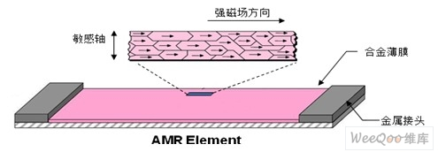

#                                       ***磁力计篇***

### 1.磁力计工作原理

磁力计中采用一个**异性磁致电阻（AMR）**来检测空间中磁感应强度大小。这种电阻对外界磁场非常敏感，磁场强弱变化会导致**AMR**自身阻值变化。

在生产过程中，先将一个强磁场加在AMR上，使其在某一方向上磁化，建立一个**主磁域**，与**主磁域**垂直的轴被称为AMR的**敏感轴**。（如下图所示）

为了使测量结果以**线性**的方式变化，AMR材料上的金属导线呈**45°角**排列，电流从这些导线上流过。




当有外界磁场**Ha**时，AMR上主磁方向会发生变化，其**与电流的夹角θ**也会发生变化，经过相应的检测电路之后就可以测得磁场变化。


### 2.磁力计误差

##### 理想情况

在理想情况下，磁力计测量结果是完全准确的，磁传感器在不同角度上的测量值应该落在一个以**原点**为球心，**B**为半径的**正球**上

##### 内部误差

内部误差有三种

1. 三轴灵敏度不同：比如100uT的磁感应强度，用传感器的三个轴来测量，结果分别为：100uT，90uT，110uT。
2. 三轴不正交。比如XY轴不正交，我们测量的理想读数为[100uT,0,0]，但是因为不正交，实际测量的值为[100uT,10uT,0]。
3. 零偏。没有磁场时也有一个初始值。

##### 外部误差

1. 硬磁干扰。由传感器附近的永磁体引起的，类似于零偏。会导致**正球的圆心不再是圆点**。
2. 软磁干扰。是传感器周围的的铁磁材料引起的。会使**正球**变成一个**椭球**。

### 3.磁力计椭球拟合

#### 最小二乘法

其原理就是建立一个**误差方程**，然后求对应参数**使误差平方和最小**。

#### 椭球拟合

我们已知因为硬磁和软磁干扰，磁力计测量出的数据将会落在一个**偏离原点的椭球**上。

我们想要做的就是将我们测量的数据，纠正（映射）到一个球心在**原点的正球**上。

明白了上面的道理，我们就来看一下具体步骤该怎么做。

首先我们看一下椭球的**标准方程**
$$
(\frac{x-x_0}{A} )^2+(\frac{y-y_0}{B} )^2+(\frac{z-z_0}{C} )^2=1
$$
我们令
$$
\left\{\begin{matrix} 
  X_0=\frac{x-x_0}{A} \\  
  Y_0=\frac{y-y_0}{B} \\
  Z_0 = \frac{z-z_0}{C}
\end{matrix}\right.
$$
此时椭球标准方程就变成了正球方程
$$
X_0^2 + Y_0^2 + Z_0^2 = 1
$$
所以我们想要纠正磁力计，就需要求出**x0**,**y0**,**z0**,**A**,**B**,**C** 即可。

将椭圆的标准式展开
$$
\frac{1}{A^2}x^2 + \frac{1}{B^2}y^2 + \frac{1}{C^2}z^2 - \frac{2x_0}{A^2}x - \frac{2y_0}{B^2}y - \frac{2z_0}{C^2}z + \frac{x_0^2}{A^2} + \frac{y_0^2}{B^2} + \frac{z_0^2}{C^2} = 1
$$


一般写成
$$
x^2 + ay^2 + bz^2 + cx + dy + ez + f = 0
$$
其中
$$
a = \frac{A^2}{B^2} , b = \frac{A^2}{C^2} , c = -2x_0 , d = -2y_0\frac{A^2}{B^2} , e = -2z_0\frac{A^2}{C^2} , f = x_0^2 + \frac{A^2}{B^2}y_0^2 + \frac{A^2}{C^2}z_0^2 - A^2
$$
**至此，基本的准备工作已经完成，现在就要开始进行最小二乘估计。**

公式太麻烦，直接贴图了。

首先构造**误差方程**


所以**误差平方和E**为


我们要求误差平方和的最小值，所以对误差平方和**求偏导**，并令其等于0.


纠正之前会采样很多组数据，所以我们求出采样数据的平均值，再将其带入上面的方程组。


带入并化简，可以得到一个六元一次方程组。


矩阵形式为：


我们对这个方程组进行求解，就可以得到**a,b,c,d,e,f**进而求解出**x0,y0,z0,A,B,C**

### 4.磁力计误差纠正

进行了纠正之后，我们每次只需要将采集的数据进行一次简单的运算就可以得到想要的数值了。


### 5.C语言实现代码

```c
//目前还在验证中，敬请期待。。。
```

#                                         ***电子罗盘篇***

### 倾角补偿

当我们读磁力计处于水平位置时，我们可以直接通过x轴和y轴的值，用arctan()函数将偏航角计算出来。

但是当我们的磁力计倾斜时，这个时候就没有办法直接用x轴和y轴的数据进行解算。这个时候我们就要考虑怎么进行补偿，来解算出准确的偏航角。

1.利用**旋转矩阵**进行偏航角的补偿

我们首先定义，滚转角用P，俯仰角用R，偏航角用Y。

设罗盘的滚转角是P，俯仰角为R，偏航角是Y时，三轴磁力计输出的测量值是
$$
M(P,R,Y) = [Mx,My,Mz]^{T}
$$
设罗盘水平放置时，具有相同角度的地磁传感器输出为
$$
M(0,0,Y) = [M_{Hx},M_{Hy},M_{Hz}]^T
$$
我们根据罗盘实际姿态和水平面的关系，可以得出
$$
\left\{\begin{matrix} 
  M_{(P,R,Y)}=R_RR_PM_{(0,0,Y)} \\  
  M_{(0,0,Y)}=R_R^{-1}R_P^{-1}M_{(0,0,Y)} 
\end{matrix}\right. 
$$
前面两个东东，是滚转角和俯仰角的旋转矩阵


将两个矩阵带入，可以得到：


这样我们就得到了补偿后的磁力计的值，之后就可以按照反正切来进行偏航角的计算了


下面附上C代码，其实C代码非常容易

```c
//倾角补偿 + 偏航角解算
//INVVAL = π / 180 
//VAL = 180 / π
//这里建议上面两个常量提前自己算好，减轻单片机运算压力
void Inclination_compensation(_xyz_mag_s16_st *mag_data)
{
    float Hx = 0,Hy = 0;
    Hx = mag_data->mx * cosf(imu_data.rol * INVVAL) + mag_data->mz * sinf(imu_data.rol * INVVAL);
    Hy = mag_data->mx * sinf(imu_data.pit * INVVAL) * sinf(imu_data.rol * INVVAL) + mag_data->my * cosf(imu_data.pit * INVVAL) - mag_data->mz * sinf(imu_data.pit * INVVAL) * cosf(imu_data.rol * INVVAL);
    imu_data.mag_yaw = atan2f(Hx,Hy) * VAL;
    if (imu_data.mag_yaw < 0)
    {
        imu_data.mag_yaw += 360;
    }
}
```

其实倾角补偿还有一种向量叉积的方法，这个方法放到以后研读mahony算法的时候进行分析
